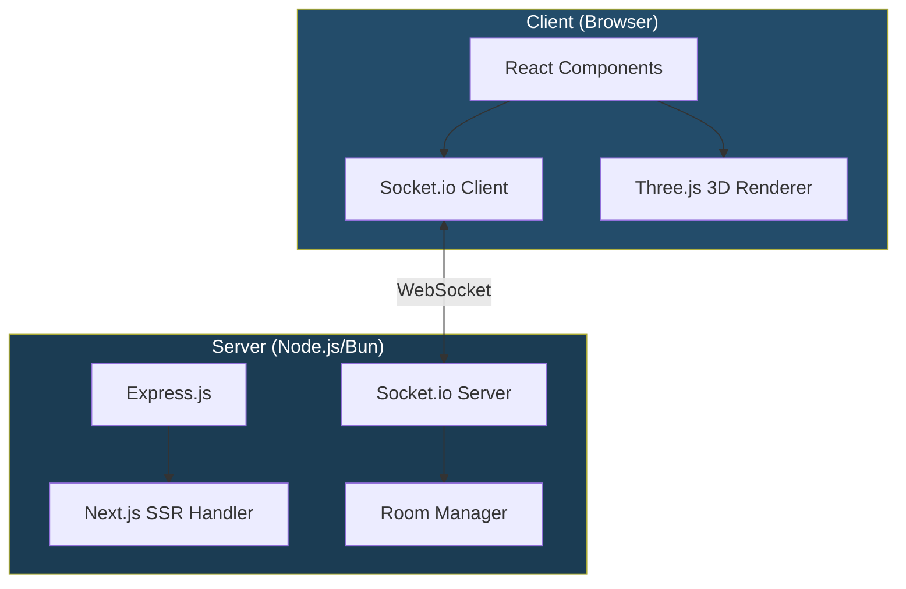
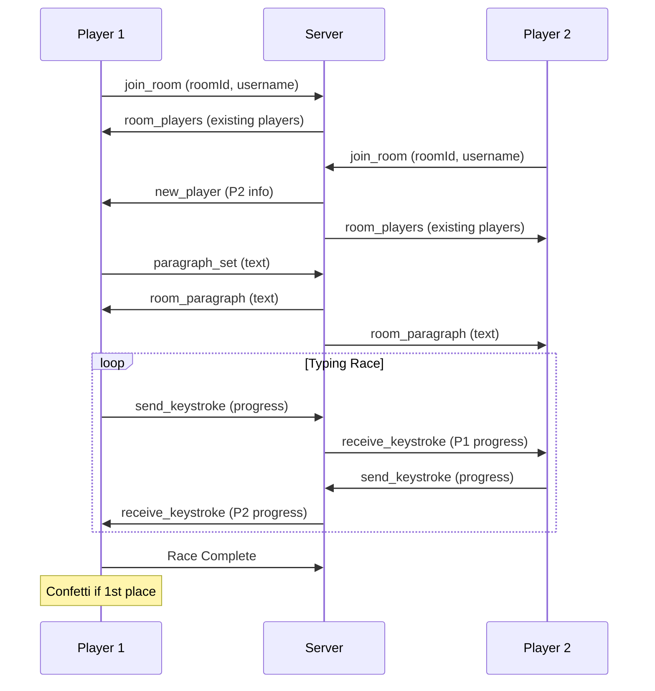
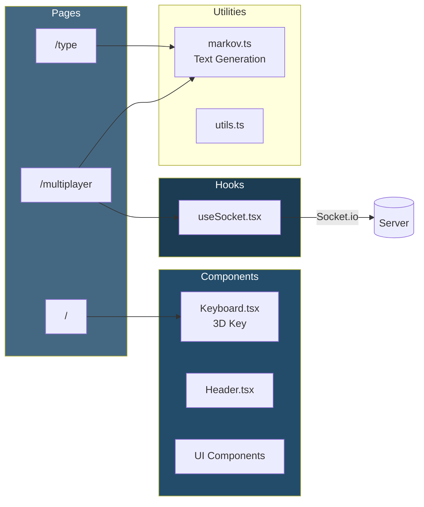
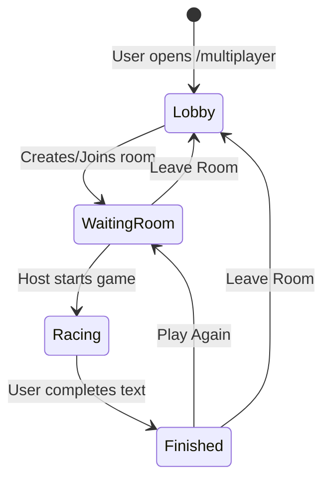

<div align="center">
  <h1>KeyStrike</h1>
  <p>A modern, real-time typing speed test application with multiplayer racing capabilities.<br/>Practice your typing skills solo or compete against friends in live races.</p>

  <a href="#getting-started"></a>
  <a href="#tech-stack"></a>
  <a href="#tech-stack"></a>
  <br/>
  <a href="#socket-events"></a>
  <a href="#features"></a>
  <a href="LICENSE"></a>
</div>

## Features

### Solo Typing Test
- Real-time WPM (Words Per Minute) calculation
- Accuracy percentage tracking
- Dynamic text generation using Markov chains

### Multiplayer Racing
- Create or join rooms with unique 6-character codes
- Real-time progress synchronization across players
- Live WPM tracking during races
- Finish position indicators

### Interactive 3D Visuals
- Three.js powered 3D keyboard key animations
- Interactive orbit controls

## Tech Stack

| Category | Technologies |
|----------|-------------|
| **Frontend** | Next.js 15, React 19, TypeScript 5 |
| **Styling** | Tailwind CSS 4, Shadcn UI |
| **3D Graphics** | Three.js |
| **Real-time** | Socket.io |
| **Backend** | Express.js 5 |
| **Tooling** | Bun, Turbopack, Biome |

## Architecture

### System Overview



### Multiplayer Flow



### Component Architecture



### Room State Management



## Getting Started

### Prerequisites

- [Bun](https://bun.sh/) (recommended) or Node.js 18+

### Installation

```bash
# Clone the repository
git clone https://github.com/yourusername/keyflow.git
cd keyflow

# Install dependencies
bun install
```

### Development

```bash
# Start the development server (includes Socket.io server)
bun run dev
```

Open [http://localhost:4000](http://localhost:4000) in your browser.

### Production

```bash
# Build the application
bun run build

# Start production server
bun start
```

## Socket Events

| Event | Direction | Payload | Description |
|-------|-----------|---------|-------------|
| `join_room` | Client → Server | `roomId` | Join a specific room |
| `player_joined` | Client → Server | `{ room, username }` | Announce player with username |
| `send_keystroke` | Client → Server | `{ room, message, sender, username }` | Broadcast typing progress |
| `receive_keystroke` | Server → Client | `{ message, sender, username }` | Receive others' progress |
| `new_player` | Server → Client | `{ id, username }` | New player joined notification |
| `room_players` | Server → Client | `Player[]` | List of current players |
| `player_left` | Server → Client | `playerId` | Player disconnection |
| `paragraph_set` | Client → Server | `{ room, paragraph }` | Set race text |
| `room_paragraph` | Server → Client | `paragraph` | Receive race text |

## Environment Variables

| Variable | Default | Description |
|----------|---------|-------------|
| `PORT` | `4000` | Server port |
| `CORS_ORIGIN` | `localhost:3000,localhost:4000` | Allowed CORS origins (comma-separated) |
| `NODE_ENV` | `development` | Environment mode |

## Contributing

Contributions are welcome! Please feel free to submit a Pull Request.

1. Fork the repository
2. Create your feature branch (`git checkout -b feature/amazing-feature`)
3. Commit your changes (`git commit -m 'Add some amazing feature'`)
4. Push to the branch (`git push origin feature/amazing-feature`)
5. Open a Pull Request

## License

This project is licensed under the MIT License - see the [LICENSE](LICENSE) file for details.

---

Built with [Next.js](https://nextjs.org/) and [Socket.io](https://socket.io/)
